# Presentation: Parts I & II — Optimal Control of a Variable-Mass Thrust-Vectoring Lander

**Course:** ECE 270C Final Project  
**Scope:** Part I (fixed-time LQR, controllability) and Part II (trajectory tracking)  
**Code:** [`p1_linearization.ipynb`](p1_linearization.ipynb), [`p2_tracking.ipynb`](p2_tracking.ipynb)  
**Figures:** regenerate with `python export_presentation_figures.py` → [`figures/presentation/`](figures/presentation/)

---

## Narrative arc (45–60 min)

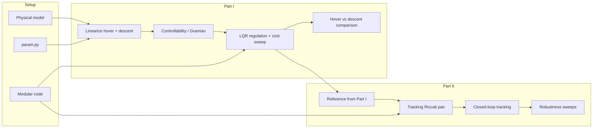

**Core thesis:** Part I explains *why* the plant is easy or hard to control (Gramian geometry) and selects cost weights. Part II shows *how* to rejoin a pre-planned trajectory after a large phase-transition error — and where the method fails without full reference preview.

---

## Slide 0 — Title & project map

**Title:** Optimal Control of a Variable-Mass Thrust-Vectoring Lander

| Part | Status | Content |
|------|--------|---------|
| **I** | Complete | Fixed-time LQR; hover LTI + descent LTV; controllability; cost tuning |
| **II** | Complete | Finite-horizon tracking LQR; reference from Part I; robustness |
| **III** | Future | Min-time ascent + free-final-time landing manifolds |
| **IV** | Future | Nonlinear hover validation |

**Deliverables (PDF §2–3):** PMP-based derivations, interpreted figures, modular runnable code.

### Modular software map

| Module | Role |
|--------|------|
| [`param.py`](param.py) | Physical parameters, descent trim config |
| [`dynamics.py`](dynamics.py) | Trim, Jacobians, Gramian, controllability |
| [`lqr.py`](lqr.py) | Backward Riccati, tracking feedforward, closed-loop sim |
| [`analysis.py`](analysis.py) | Cost presets, regulation sweeps, hover/descent compare |
| [`export_presentation_figures.py`](export_presentation_figures.py) | Reproduce all presentation PNGs |
| [`p1_linearization.ipynb`](p1_linearization.ipynb) | Part I experiments |
| [`p2_tracking.ipynb`](p2_tracking.ipynb) | Part II experiments |

---

## Slide 1 — Physical system (PDF §4)

### State and control

State (deviations from trim unless noted):

\[
x = [p_x,\; p_z,\; v_x,\; v_z,\; \theta,\; \omega,\; m]^\top
\]

Control:

\[
u = [\delta T,\; \tau]^\top, \qquad \delta T = T - T^\*
\]

### Nonlinear dynamics

\[
\dot p_x = v_x,\quad \dot p_z = v_z,\quad
\dot v_x = \frac{T}{m}\sin\theta,\quad
\dot v_z = \frac{T}{m}\cos\theta - g
\]
\[
\dot\theta = \omega,\quad \dot\omega = \frac{\tau}{I},\quad \dot m = -\alpha T
\]

### Parameters ([`param.py`](param.py))

| Symbol | Value |
|--------|-------|
| \(g\) | 9.8 m/s² |
| \(I\) | 10 kg·m² |
| \(m_0\) | 20 kg |
| \(\alpha\) | 0.005 kg/(N·s) |
| \(T\) | [0, 300] N |
| \(\tau\) | [−30, 30] N·m |
| \(t_f\) | 20 s |
| \(v_x^\*\) | 40 → 25 m/s (bleed) |
| \(v_z^\*\) | −8 m/s |
| \(\theta^\*\) | ≈ 0 rad |

**Constraints (PDF §4.3):** \(p_z \ge 0\), \(m \ge m_{\mathrm{dry}}\). Not enforced in the LQR formulation; trajectories must be checked post hoc (deviation coordinates: ensure absolute altitude stays feasible).

---

## Slide 2 — Part I.5.1: Hover linearization

**Trim:** \(v_x^\*=v_z^\*=\theta^\*=\omega^\*=0\), \(T^\*=m_0 g\)

**Linearized plant:** \(\dot x = A x + B u\) in deviation coordinates.

### Jacobian ([`linearize_at_trim`](dynamics.py))

With \(c=\cos\theta^\*\), \(s=\sin\theta^\*\), trim \((m, T)\):

**\(A\) — kinematics + coupling**

| Entry | Value | Meaning |
|-------|-------|---------|
| \(A_{0,2}, A_{1,3}, A_{4,5}\) | 1 | Position–velocity, angle–rate |
| \(A_{2,4}\) | \(Tc/m\) | Tilt → horizontal accel |
| \(A_{2,6}\) | \(-Ts/m^2\) | Mass → horizontal accel |
| \(A_{3,4}\) | \(-Ts/m\) | Tilt → vertical accel |
| \(A_{3,6}\) | \(-Tc/m^2\) | Mass → vertical accel |

**\(B\) — inputs**

| Entry | Value |
|-------|-------|
| \(B_{2,0}\) | \(s/m\) |
| \(B_{3,0}\) | \(c/m\) |
| \(B_{5,1}\) | \(1/I\) |
| \(B_{6,0}\) | \(-\alpha\) |

**At hover (\(\theta^\*=0\)):** thrust affects only \(\dot v_z\) and \(\dot m\). Horizontal motion requires \(\tau \to \omega \to \theta \to v_x \to p_x\).

**Code:** `dyn.get_hover_dynamics(t, params)` → constant \((A, B)\).

---

## Slide 3 — Part I.5.2: Weakly controllable descent trim

**PDF regime:** \(\theta^\*\approx 0\), \(v_x^\* \gg 0\), \(v_z^\*<0\), \(T^\*\approx mg\).

### Nominal trim ([`descent_trim`](dynamics.py))

- \(m(t) = m_0 e^{-\alpha g t}\)
- \(T^\*(t) = m(t)\, g / \cos\theta^\*\)
- \(v_x^\*(t) = v_{x,\mathrm{descent}}(1 - 0.5\,t/t_f)\)
- \(v_z^\* = -8\) m/s

**LTV model:** `dyn.get_descent_dynamics(t, params)` → \(A(t), B(t)\).

### Physical mechanism (lead with this)

1. At \(\theta^\*\approx 0\), \(\dot v_x \approx (T^\*/m)\,\theta\) — thrust cannot push horizontally.
2. Horizontal correction: \(\tau \to \omega \to \theta \to v_x \to p_x\) (slow chain).
3. Large \(v_x^\*\) carries horizontal momentum the controller cannot cancel directly.

**Late-trim snapshot (\(t=15\) s):** \(m=9.59\) kg, \(v_x^\*=25\) m/s. Algebraic \(\mathcal{C}\) still rank 7, but 6th singular value of snapshot matrix rises from ~0.05 (early) to ~0.10 (late).

---

## Slide 4 — Controllability analysis (PDF §5.2)

### Three computational tools

1. **Algebraic controllability matrix** \(\mathcal{C} = [B,\ AB,\ \ldots,\ A^{n-1}B]\) — `dyn.controllability_matrix`
2. **Finite-horizon Gramian** \(\dot W = AW + WA^\top + BB^\top\) — `dyn.finite_horizon_gramian`
3. **Remaining-horizon Gramian** on \([t, t_f]\) — `dyn.compare_along_trajectory` (reveals late-horizon deterioration)

### 7th vs 6th singular value

| SV | Interpretation |
|----|----------------|
| \(\sigma_7 \approx 0\) | Mass mode: fuel burn only, not replenishable → structurally uncontrollable |
| \(\sigma_6\) | Weakest *physical* mode (horizontal / attitude coupled) → `sigma_structural_min` |

### Snapshot at \(t=0\), horizon 20 s

| Metric | Hover LTI | Descent LTV |
|--------|-----------|-------------|
| rank(\(\mathcal{C}\)) | 7/7 | 7/7 |
| rank(\(W_{0\to20}\)) | 7/7 | **6/7** |
| \(\sigma_6(W)\) | 0.0109 | 0.0109 |

### GRAPH 1 — Remaining-horizon controllability (PRIORITY)

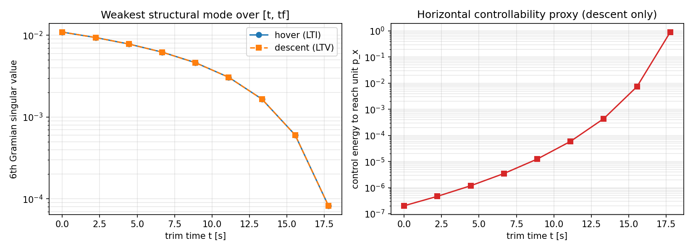

**Source:** `dyn.compare_along_trajectory(params)` in [`p1_linearization.ipynb`](p1_linearization.ipynb)

**Left panel — 6th Gramian singular value vs trim time**

- \(\sigma_6\) drops from \(1.09\times10^{-2}\) at \(t=0\) to \(8.2\times10^{-5}\) at \(t=17.8\) s.
- Hover and descent curves overlap (same remaining-horizon metric at shared trim).
- **Meaning:** controllable energy in the weakest meaningful mode collapses as \(t_f - t\) shrinks.

**Right panel — horizontal energy proxy (descent only)**

- Proxy: `horizontal_energy_index` ≈ control energy to reach unit \(p_x\) perturbation over remaining horizon.
- Grows from \(\sim 2\times10^{-7}\) early to **\(\sim 0.9\)** with 2.2 s remaining.
- **Meaning:** horizontal corrections become prohibitively expensive near landing.

| \(t\) [s] | remaining [s] | \(\sigma_6\) | horiz. energy |
|-----------|-----------------|--------------|---------------|
| 0.0 | 20.0 | 1.09e−02 | 2.03e−07 |
| 11.1 | 8.9 | 3.07e−03 | 5.89e−05 |
| 15.6 | 4.4 | 6.03e−04 | 7.36e−03 |
| 17.8 | 2.2 | 8.22e−05 | **8.99e−01** |

**Python chain:**

```python
rows = dyn.compare_along_trajectory(params)
# each row: finite_horizon_gramian(..., t, tf), sigma_structural_min, horizontal_energy_index
```

---

## Slide 5 — Part I.5.3–5.4: Regulation LQR from PMP

### Problem (PDF §5.3)

\[
\min_u \int_0^{t_f} (x^\top Q x + u^\top R u)\,dt + x(t_f)^\top Q_f x(t_f)
\quad \text{s.t.} \quad \dot x = A(t)x + B(t)u,\; x(t_f)\ \text{free}
\]

### PMP (PDF §5.4)

**Hamiltonian:** \(H = x^\top Q x + u^\top R u + \lambda^\top(Ax + Bu)\)

**Stationarity:** \(\partial H/\partial u = 0 \Rightarrow u^* = -R^{-1} B^\top \lambda\) (with \(\tfrac12\) in running cost)

**Adjoint:** \(-\dot\lambda = 2Qx + A^\top\lambda\), \(\lambda(t_f) = 2Q_f x(t_f)\)

**Riccati ansatz** \(\lambda = Px\):

\[
-\dot P = A^\top P + PA - PBR^{-1}B^\top P + Q, \quad P(t_f) = Q_f
\]

**Feedback:** \(u^*(t) = -K(t)\,x(t)\), \(K(t) = R^{-1} B^\top P(t)\)

### Regulation pipeline

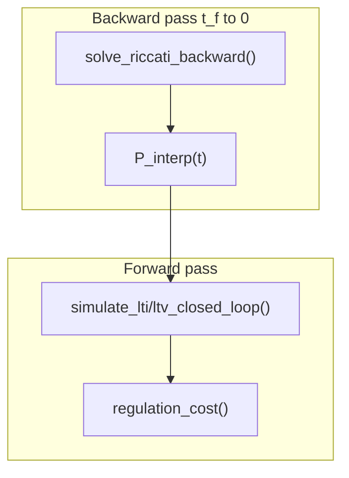

```python
P_interp = lqr.solve_riccati_backward(dynamics_func, t_grid, Q, R, Qf, params)
u = lqr.regulation_control(t, x, dynamics_func, P_interp, Q, R, params)
x_hist, u_hist = lqr.simulate_ltv_closed_loop(dynamics_func, t_grid, ctrl, x0, params)
J = lqr.regulation_cost(x_hist, u_hist, Q, R, Qf, t_grid)
```

---

## Slide 6 — Part I.5.5(i): Cost matrix sweep

### Weights used in Part II reference ([`p2_tracking.ipynb`](p2_tracking.ipynb))

\[
Q = \mathrm{diag}(1,\,1,\,0.5,\,0.5,\,10,\,5,\,0.01),\quad
R = \mathrm{diag}(0.1,\,1.0),\quad
Q_f = \mathrm{diag}(10,\,10,\,1,\,1,\,50,\,20,\,0.1)
\]

Attitude-heavy \(Q\); cheap thrust, expensive torque in \(R\).

### Presets swept ([`analysis.py`](analysis.py))

`balanced`, `position_heavy`, `attitude_heavy`, `cheap_thrust`, `expensive_torque`, `scaled_identity`

**Nondimensionalization:** \(\tilde x_i = x_i / x_{i,\mathrm{ref}}\) with scales \([10,10,5,5,0.2,0.5,1]\) → \(Q_{ii} = 1/x_{i,\mathrm{ref}}^2\).

**IC:** `x0_reg = [5, 8, 2, −1.5, 0.08, 0, 0.3]`, \(\|x_{0,\mathrm{reg}}\| \approx 10.3\).

### Cost sweep results (hover LTI, fresh run)

| preset | \(J\) | \(E_u=\int\|u\|^2dt\) | \(\|x(t_f)\|\) | peak \(\|x\|\) | \(t_{\mathrm{settle}}\) [s] |
|--------|------|------------------------|----------------|----------------|------------------------------|
| balanced | 857.8 | 1694.8 | 0.051 | 10.56 | 10.75 |
| **position_heavy** | **6164.9** | **7805.8** | **0.041** | 10.32 | **7.45** |
| attitude_heavy | 971.1 | 1514.3 | 0.051 | 10.84 | 11.20 |
| cheap_thrust | 797.2 | 9911.7 | 0.041 | 10.42 | 9.50 |
| expensive_torque | 1695.2 | 1404.1 | 0.079 | 11.89 | 14.35 |
| scaled_identity | 347.8 | 207.2 | 39.399 | 39.40 | — |

**Selection rule:** minimize \(\|x(t_f)\|\), tie-break on \(J\) → **`position_heavy`** for hover/descent comparison in Part I.5.5(ii). Part II uses the **`balanced`** weights above for the reference trajectory (as in the notebook).

### GRAPH 2 — Cost preset comparison

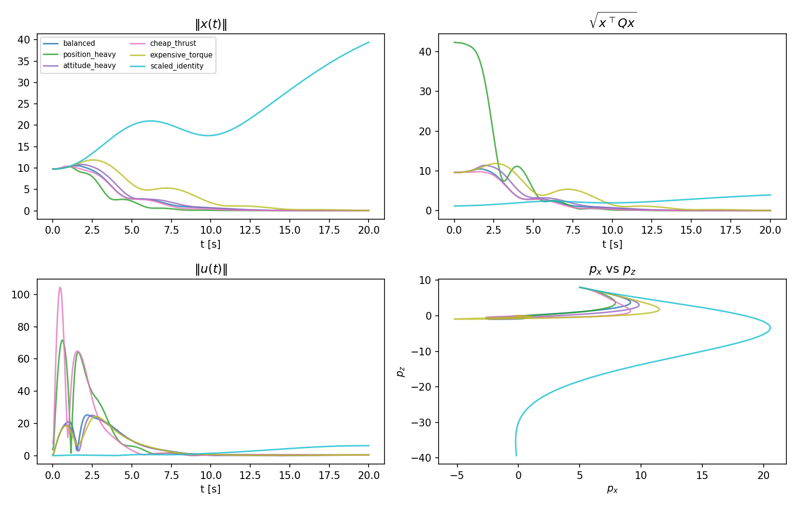

| Panel | Talk track |
|-------|------------|
| \(\|x(t)\|\) | Settling speed vs preset aggressiveness |
| \(\sqrt{x^\top Qx}\) | Cost-weighted transient — attitude-heavy presets penalize \(\theta,\omega\) more |
| \(\|u(t)\|\) | `cheap_thrust` uses more \(\delta T\); `expensive_torque` suppresses \(\tau\) |
| \(p_x\) vs \(p_z\) | Geometric feasibility — `scaled_identity` fails to return to trim |

**Code:** `ana.sweep_cost_presets(dyn.get_hover_dynamics, t, x0_reg, params)`

---

## Slide 7 — Part I.5.5(ii): Hover vs descent

Same \(Q,R,Q_f\) (`position_heavy`), same `x0_reg`, IC sweep \(x_0(\alpha) = x_{0,\mathrm{reg}} + \alpha\,\Delta x_0\), \(\alpha \in [0.25, 2.0]\).

### Single-IC comparison

| model | \(J\) | \(E_u\) | \(\|x(t_f)\|\) | peak \(\|x\|\) | \(t_{\mathrm{settle}}\) |
|-------|------|---------|----------------|----------------|-------------------------|
| hover LTI | 6164.9 | 7805.8 | 0.041 | 10.32 | 7.45 s |
| descent LTV | 6431.4 | 5779.4 | 0.058 | 10.22 | 8.05 s |

Descent: **higher cost and terminal error**, different control energy profile — consistent with time-varying, weakly coupled horizontal dynamics.

### GRAPH 3 — Hover vs descent 2×2 (PRIORITY)

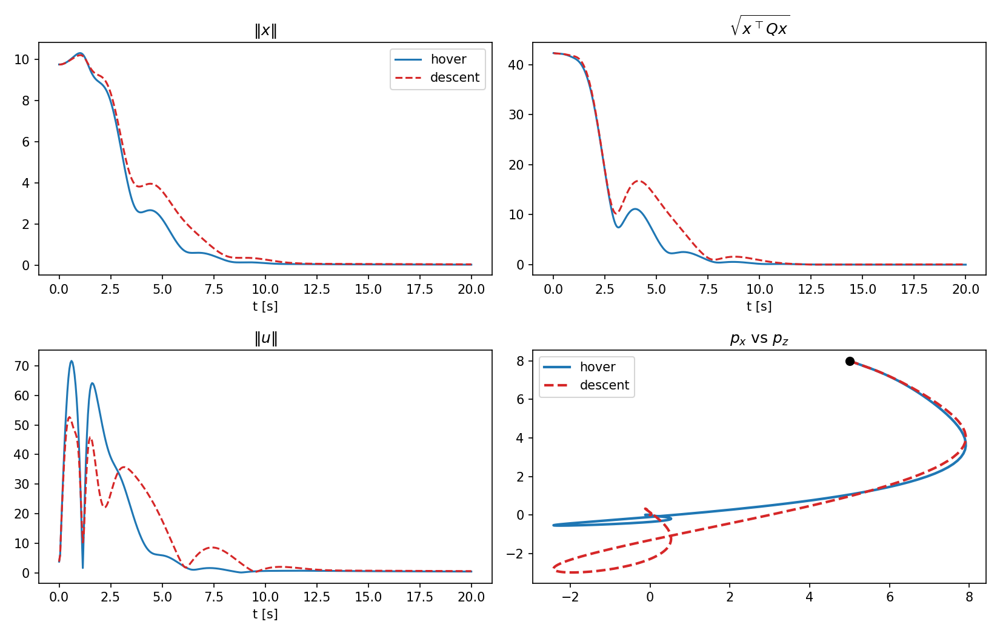

| Panel | Interpretation |
|-------|----------------|
| \(\|x\|\) | Descent comparable peak, slightly slower decay |
| \(\sqrt{x^\top Qx}\) | Descent pays more weighted cost mid-horizon |
| \(\|u\|\) | Different control scheduling under LTV \(A(t)\) |
| \(p_x\) vs \(p_z\) | Horizontal path shape differs under same LQR weights |

### GRAPH 4 — Weak-direction transients

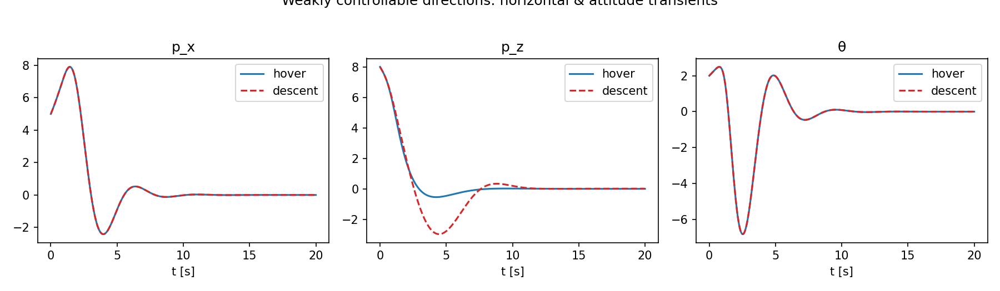

Focus on \(p_x\), \(p_z\), \(\theta\): horizontal and attitude channels show where weak controllability matters.

### GRAPH 5 — IC sensitivity (PRIORITY)

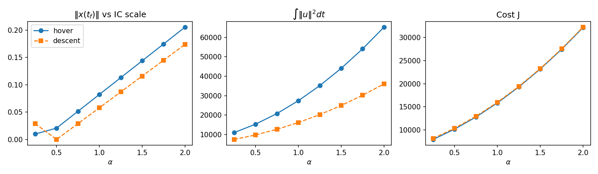

**Terminal \(\|x(t_f)\|\) vs \(\alpha\):**

| \(\alpha\) | hover | descent |
|------------|-------|---------|
| 0.25 | 0.010 | 0.029 |
| 1.00 | 0.082 | 0.058 |
| 2.00 | 0.205 | 0.174 |

Hover terminal error grows roughly linearly with \(\alpha\). Descent shows different sensitivity structure (LTV plant + weak horizontal coupling). Control energy and \(J\) panels show steeper descent slopes at large \(\alpha\) in control-energy channel.

**Code:** `ana.compare_linearizations(hover, descent, t, Q, R, Qf, x0_reg, params, ic_alphas, delta_x0)`

---

## Slide 8 — Bridge: Part I → Part II

1. **Hover LTI** — controllable baseline (rank 7); used for Part II Riccati integration.
2. **Descent LTV** — late horizontal authority collapse (Graph 1); motivates mission-phase risk.
3. **Reference plan** — Part I regulation with `balanced` weights produces \(x_{\mathrm{ref}}(t) \to\) trim by \(t_f\).

**Reference metrics:** \(J_{\mathrm{ref}} = 857.84\), \(x_{\mathrm{ref}}(t_f) \approx 0\).

---

## Slide 9 — Part II: Tracking problem (PDF §6)

\[
\min_u \int_0^{t_f} \big[(x-x_{\mathrm{ref}})^\top Q (x-x_{\mathrm{ref}}) + u^\top R u\big]\,dt
\quad \text{s.t.} \quad \dot x = A(t)x + B(t)u,\; x(t_f)\ \text{free}
\]

**Key change:** no terminal cost → \(P(t_f)=0\), \(s(t_f)=0\), \(\lambda(t_f)=0\).

### Tracking PMP

**Hamiltonian:** \(H = (x-x_{\mathrm{ref}})^\top Q(x-x_{\mathrm{ref}}) + u^\top R u + \lambda^\top(Ax+Bu)\)

**Adjoint:** \(-\dot\lambda = 2Q(x-x_{\mathrm{ref}}) + A^\top\lambda\)

**Affine ansatz** \(\lambda = Px + s\):

\[
-\dot P = A^\top P + PA - PBR^{-1}B^\top P + Q, \quad P(t_f)=0
\]
\[
-\dot s = (A - BR^{-1}B^\top P)^\top s + Q x_{\mathrm{ref}}(t), \quad s(t_f)=0
\]

**Control:**

\[
u^* = -K(t)(x - x_{\mathrm{ref}}) - R^{-1}B^\top s, \quad K = R^{-1}B^\top P
\]

When \(x_{\mathrm{ref}}\equiv 0\): \(s\equiv 0\) → Part I regulation \(u=-Kx\).

### Tracking pipeline

```python
# 1. Reference from Part I regulation
xref, uref = lqr.simulate_lti_closed_loop(A, B, t, reg_ctrl, x0_ref)

# 2. Backward pass (P(tf)=0)
P_trk, _, _ = lqr.solve_riccati_backward(df, t, Q, R, np.zeros((7,7)), params)
s_interp, _, _, xref_interp = lqr.solve_tracking_feedforward(df, t, Q, R, xref, P_trk, params)

# 3. Closed-loop tracking (note: tracking_control returns (u, K) — use [0] for simulator)
trk_ctrl = lambda tt, xx: lqr.tracking_control(...)[0]
x_trk, u_trk = lqr.simulate_lti_closed_loop(A, B, t, trk_ctrl, x0_track)
```

---

## Slide 10 — Reference trajectory (Part II Step 1)

**Construction:** solve Part I regulation from `x0_ref`; closed-loop trajectory under \(u=-K_{\mathrm{reg}}(t)x\) becomes \(x_{\mathrm{ref}}(t)\).

### GRAPH 6 — Reference states and controls

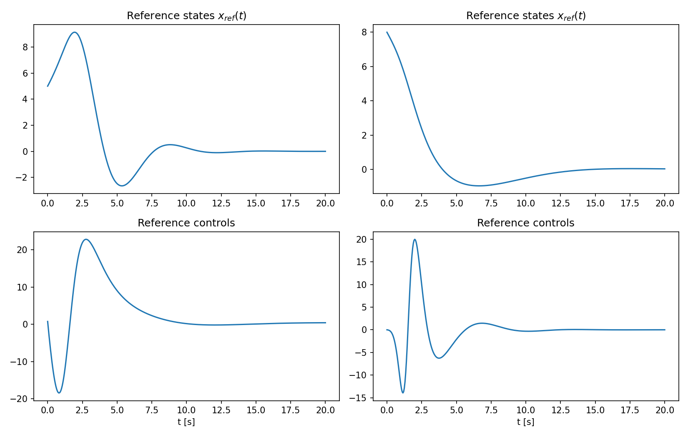

All seven states decay toward trim; \(\delta T\) and \(\tau\) show the planned actuation profile. Attitude transient is the actuator path for correcting position at \(\theta^\*\approx 0\).

### GRAPH 7 — Reference mission path (PRIORITY)

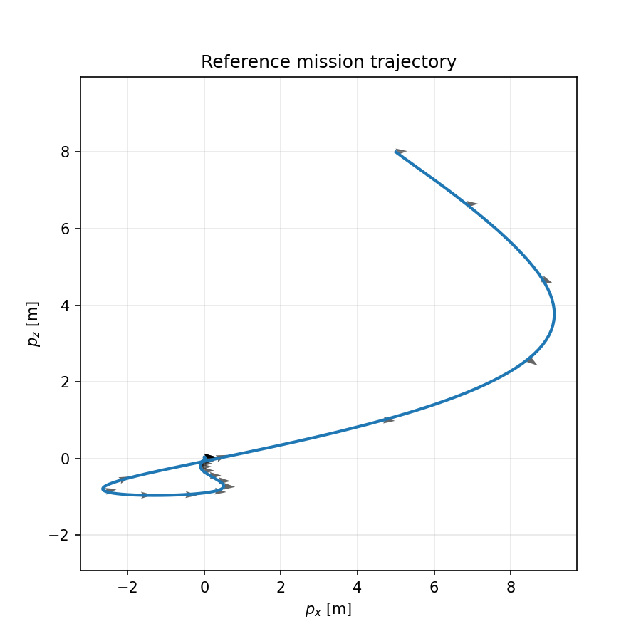

\((p_x, p_z)\) with attitude arrows (quiver on \(\theta\)). Geometric mission segment: shed altitude while correcting horizontal offset.

---

## Slide 11 — Large-IC tracking (Part II Step 2)

**PDF requirement:** substantially different initial condition.

| | `x0_ref` | `x0_track` |
|---|----------|------------|
| Vector | [5, 8, 2, −1.5, 0.08, 0, 0.3] | [−12, 15, −4, 3, −0.25, 0.4, −0.8] |
| Norm | 10.3 | 22.9 |
| \(\|x_0 - x_{\mathrm{ref}}(0)\|\) | — | **19.9** |

### Summary metrics

| Metric | Value |
|--------|-------|
| \(J_{\mathrm{ref}}\) | 857.84 |
| \(J_{\mathrm{trk}}\) | 6222.55 |
| Overall RMS error | 16.449 |
| \(\int\|u\|^2 dt\) ref / trk | 1694.8 / **10031.5** (~6×) |

### Per-state tracking error

| state | RMS | peak | \(\|e(t_f)\|\) |
|-------|-----|------|----------------|
| \(p_x\) | 10.842 | 28.755 | 3.133 |
| \(p_z\) | 10.985 | 23.243 | 0.559 |
| \(v_x\) | 4.838 | 12.865 | 1.787 |
| \(v_z\) | 2.898 | 5.939 | 0.086 |
| \(\theta\) | 0.382 | 1.252 | 0.071 |
| \(\omega\) | 0.393 | 1.324 | 0.326 |
| \(m\) | 0.507 | 1.164 | 0.278 |

Position errors dominate RMS; attitude tracks well (high \(Q_\theta, Q_\omega\)).

### GRAPH 8 — States vs reference (PRIORITY)

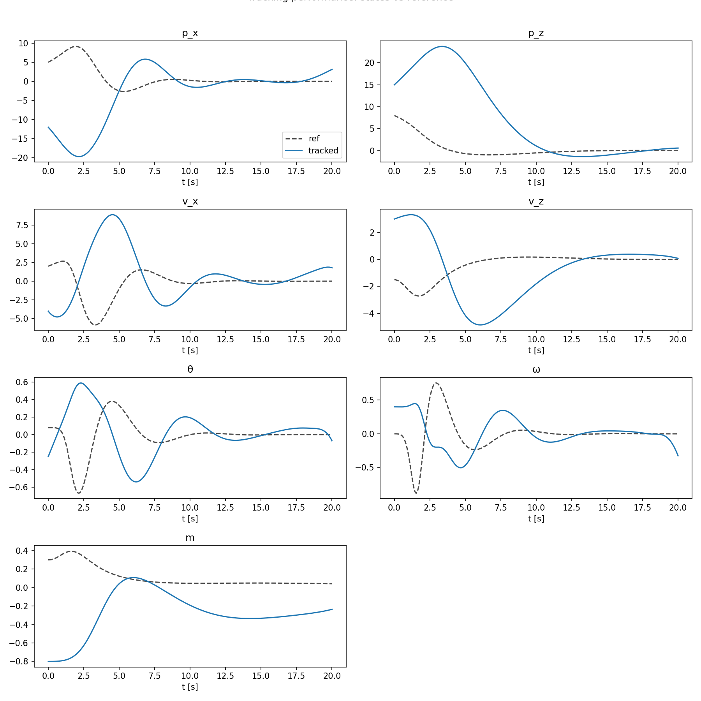

Dashed = \(x_{\mathrm{ref}}\), solid = tracked. Large initial separation; convergence over horizon. \(p_x, p_z\) show dominant transient.

### GRAPH 9 — Mission plane convergence (PRIORITY)

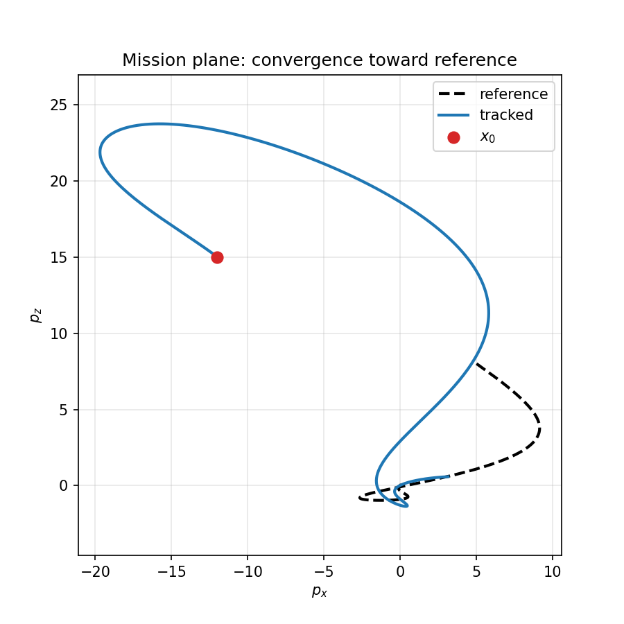

Red dot = tracking \(x_0\). Vehicle rejoins reference curve by mid-horizon; residual terminal error in \(p_x\).

---

## Slide 12 — Error dynamics & control decomposition

### GRAPH 10 — Weighted error norm

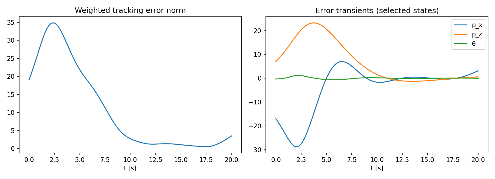

- Left: \(\sqrt{e^\top Q e}\) — scalar tracking error decay.
- Right: \(e_{p_x}, e_{p_z}, e_\theta\) — position errors decay slower than attitude.

### GRAPH 11 — Control decomposition (PRIORITY)

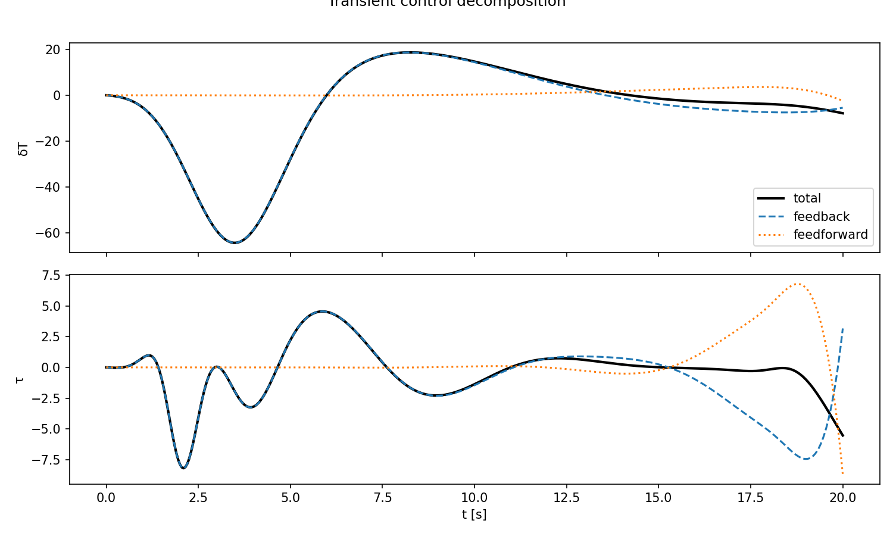

Per channel: total \(u\), feedback \(-K(x-x_{\mathrm{ref}})\), feedforward \(-R^{-1}B^\top s\).

**Talk track:** Early horizon dominated by **feedback** (cancel large phase error). Feedforward \(s(t)\) encodes future reference preview — without it, tracker would lag. This is the structural difference from Part I.

### GRAPH 12 — Control effort: reference vs tracking

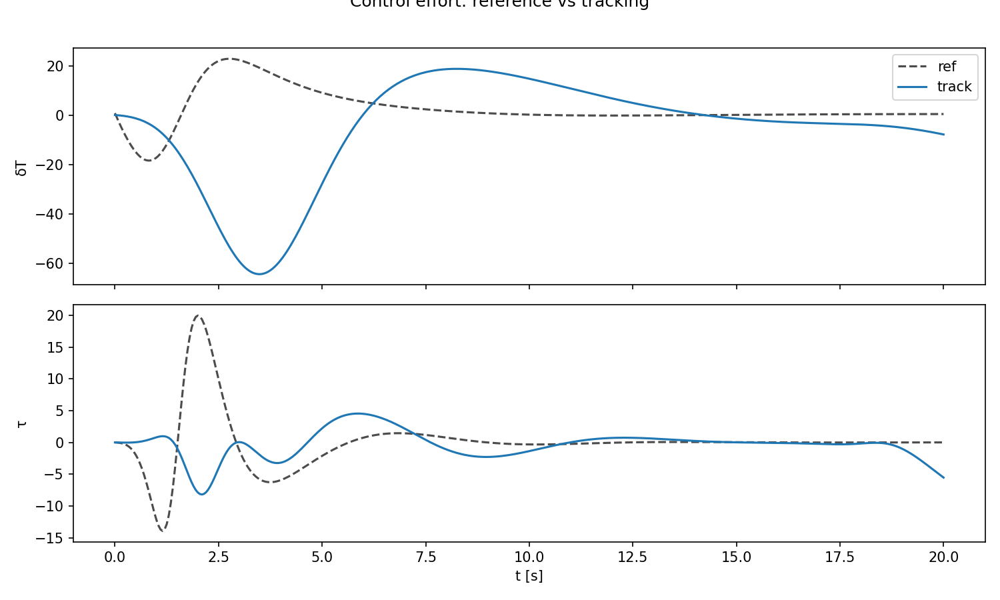

Tracking requires ~6× control energy: first cancel phase error, then match reference control profile.

---

## Slide 13 — Robustness (PDF §6.1)

### Experiment A — IC sweep

\(x_0(\alpha) = x_{0,\mathrm{ref}} + \alpha(x_{0,\mathrm{track}} - x_{0,\mathrm{ref}})\), \(\alpha \in [0.2, 1.5]\)

| \(\alpha\) | \(\|x(t_f)-x_{\mathrm{ref}}(t_f)\|\) | \(J_{\mathrm{trk}}\) |
|------------|---------------------------------------|----------------------|
| 0.20 | 3.703 | 556.0 |
| 0.57 | 3.687 | 2003.3 |
| 0.94 | 3.678 | 5502.2 |
| 1.31 | 3.676 | 11052.6 |
| 1.50 | 3.678 | 14597.1 |

Terminal error plateaus (~3.7 m state-norm scale in deviation coords); cost grows sharply with \(\alpha\).

### GRAPH 13 — IC robustness (PRIORITY)

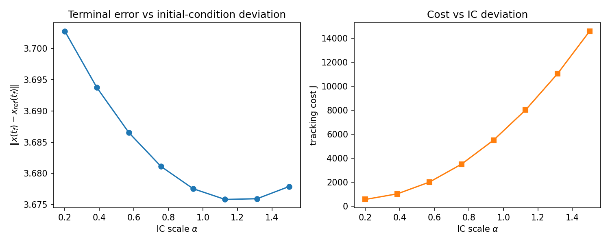

### Experiment B — Noisy reference plan

Gaussian noise on \(x_{\mathrm{ref}}\); re-solve \(s(t)\); measure error vs **true** reference.

| \(\sigma_{\mathrm{noise}}\) | terminal error | \(J_{\mathrm{trk}}\) |
|-----------------------------|----------------|----------------------|
| 0.00 | 3.677 | 6222.5 |
| 0.05 | 3.740 | 6310.1 |
| 0.15 | 3.735 | 7096.4 |
| 0.30 | 4.111 | 10042.0 |

### GRAPH 14 — Reference noise robustness

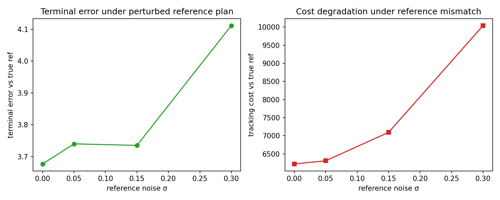

Feedforward \(s\) built from noisy preview degrades cost; terminal error modest until large \(\sigma\).

---

## Slide 14 — Regulation vs tracking & limitations

| Aspect | Part I regulation | Part II tracking |
|--------|-------------------|------------------|
| Running cost | \(x^\top Qx + u^\top Ru\) | \((x-x_{\mathrm{ref}})^\top Q(x-x_{\mathrm{ref}}) + u^\top Ru\) |
| Terminal | \(\lambda(t_f)=2Q_f x(t_f)\) | \(\lambda(t_f)=0\), \(P(t_f)=0\) |
| Control | \(u=-Kx\) | \(u=-K(x-x_{\mathrm{ref}})-R^{-1}B^\top s\) |
| Extra ODE | Riccati only | Riccati + feedforward \(s\) |
| Role | Return to trim | Follow pre-planned segment |

### What if the reference is not known in advance? (PDF §6.1)

1. **\(s(t)\) needs preview** — backward integration uses full future \(x_{\mathrm{ref}}\). Without it: receding-horizon LQR or MPC.
2. **LTV \(A(t),B(t)\) tied to nominal path** — wrong linearization if vehicle deviates; hurts horizontal channel most (Graph 1).
3. **No online replanning** — large disturbances may make reference unreachable within fuel/horizon.
4. **State constraints** — \(p_z \ge 0\) not in QP tracker; need constrained MPC wrapper.

**Extension:** LTV descent tracking via `get_descent_dynamics` + `simulate_ltv_closed_loop` — expect larger terminal errors late in horizon.

---

## Slide 15 — Reproducibility

```bash
cd optimal-control-lander
python -m venv .venv && source .venv/bin/activate
pip install numpy scipy control matplotlib
python export_presentation_figures.py    # all PNGs
jupyter notebook p1_linearization.ipynb
jupyter notebook p2_tracking.ipynb
```

**Configurable without rewriting solvers:**

- [`param.py`](param.py) — \(g, m_0, t_f, v_x^\*, v_z^\*\), etc.
- Notebook / [`COST_PRESETS`](analysis.py) — \(Q, R, Q_f\)
- `x0_reg`, `x0_track`, sweep ranges
- `get_hover_dynamics` ↔ `get_descent_dynamics`
- `np.linspace(0, tf, N)` — time grid

---

## Appendix A — Function reference

### [`dynamics.py`](dynamics.py)

| Function | Output | Role |
|----------|--------|------|
| `descent_trim(t, params)` | trim dict | Nominal powered descent |
| `linearize_at_trim(trim, params)` | \(A, B\) | Jacobian |
| `get_hover_dynamics` | constant \(A,B\) | Part I.5.1 |
| `get_descent_dynamics` | \(A(t),B(t)\) | Part I.5.2 LTV |
| `finite_horizon_gramian` | \(W\) | Controllability energy |
| `compare_along_trajectory` | metric rows | Remaining-horizon study |
| `horizontal_energy_index` | scalar | Horizontal authority proxy |
| `sigma_structural_min` | \(\sigma_6\) | Ignore mass mode |

### [`lqr.py`](lqr.py)

| Function | Role |
|----------|------|
| `riccati_rhs` | Backward \(P\) ODE |
| `solve_riccati_backward` | `solve_ivp` + `P_interp` |
| `tracking_s_rhs` | Backward \(s\) ODE |
| `solve_tracking_feedforward` | \(s\) integrator |
| `regulation_control` / `tracking_control` | Control law (\(tracking\) returns \((u,K)\)) |
| `simulate_lti/ltv_closed_loop` | RK4 roll-out |
| `regulation_cost` / `tracking_cost` | Trapezoidal quadrature |

### [`analysis.py`](analysis.py)

| Function | Role |
|----------|------|
| `cost_from_preset` | Build \(Q,R,Q_f\) |
| `run_regulation` | Full regulation experiment |
| `sweep_cost_presets` | Part I.5.5(i) |
| `compare_linearizations` | Part I.5.5(ii) |
| `ic_sensitivity_sweep` | \(\alpha\) sweep |
| `regulation_metrics` | \(J\), energy, settle time |

---

## Appendix B — Graph priority (trim list)

**Must present (8):**

1. `p1_gramian_remaining_horizon.png`
2. `p1_ic_sensitivity.png`
3. `p1_hover_vs_descent_2x2.png`
4. `p2_tracking_states_4x2.png`
5. `p2_mission_plane_convergence.png`
6. `p2_control_decomposition.png`
7. `p2_control_effort.png`
8. `p2_ic_robustness.png`

**Strong supporting (5):**

- `p1_cost_preset_sweep.png`
- `p1_weak_direction_transients.png`
- `p2_reference_states_controls.png` + `p2_reference_mission_plane.png`
- `p2_error_transients.png`
- `p2_reference_noise_robustness.png`

---

## Appendix C — Pre-submission checklist

- [x] Cost sweep table populated (see Slide 6)
- [ ] Verify absolute \(p_z \ge 0\) on all plotted trajectories
- [ ] Parts III–IV slides (future work)
- [ ] Notebook `trk_ctrl` should use `tracking_control(...)[0]` for simulator compatibility (see `export_presentation_figures.py`)
